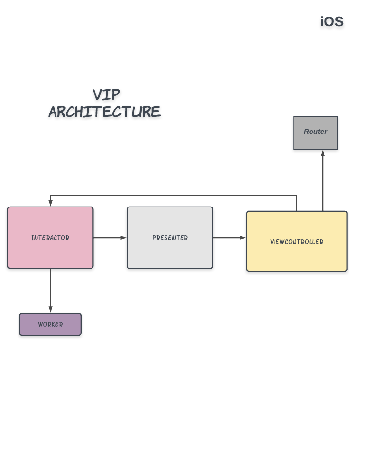

# Features!
  - Show weekly meal plans· 
  - Show day meal detail for lunch and dinner
 
# App Architecture

 - Designed first screen using react-native and second screen using swift UIKit framework.
 - RCTBridgeModule used to pass data from RN to swift class eg: Refer NavigationModule.m in ios folder.

#### React Native
 - Used javascript(.js) and typescript(.tsx) to create class and function       component
 - Used Apollo to query GraphQL.
 
#### iOS
Clean SWIFT (VIP) architecture has been adopted to structure the project
Each Module Will have its own folder. eg - 
 - DayMealListViewController 
 - DayMealListPresenter 
 - DayMealListInteractor 
 - DayMealPlan 
 - View, Service,Model, Utils etc each will have its own folder 
 
 
# Prerequisites

- Node 12.13.1
- iOS 11.0+  -
- Xcode 12
- Swift 5 
- cocoapod 1.9.0
- fastlane 2.149.1

# Installation
Follow these steps to setup the project 
- Clone the repository into a new folder in your machine; 
- git clone git@github.com:safad-tw/DietDoctor-RNMeals.git
- Install and configure the dependencies; 
- Open the Command Prompt and run: 

- Run on iOS simulator
```sh
sh ./scripts/run_ios.sh
 ```
 - Run on Android emulator
```sh
sh ./scripts/run_android.sh
 ```
 - Generate adhoc build(iPA) and upload to app centre
```sh
sh ./scripts/ios_adhoc_ipa.sh <apple_account_email> <appcenter_token_name> <appcenter_team_name> <appcenter_app_name>
 ```
 eg: 
 ```sh
 sh ./scripts/ios_adhoc_ipa.sh "msafad90@gmail.com" "3c7da989eaeb6db984081f0753a11667f0d383d7" "Diet-doctor" "Diet-doctor-Dev"
  ```
  - Generate release build(iPA) and upload to testflight
```sh
sh ./scripts/ios_appstore_ipa.sh <apple_account_email> <api_token> <owner_name> <app_name>
 ```
 
 - Generate android apk and upload to app centre
```sh
sh ./scripts/android_dev_apk.sh <store_password> <alias_password> <appcenter_api_token> <appcenter_team_name> <appcenter_app_name>
 ```
 
 # iOS Unit testing using quick and nimble
  - Used quick and nimble framework to run unit tests on ios.
  - To Run unit test, open RNMeals.xcworkspace file and run 
  ```
 command+u
 ```
  OR
  - Run following command line To run unit tests using fastlane
 ```sh
 cd ios && fastlane unit_tests
  ```
 
 # E2E testing using detox
 - Used detox to run E2E test
 - All test files are in e2e folder
 - Run following command line To run on iOS simulator
```sh
sh run-e2e-test.sh
 ```

# Contact
 - Mohammad Safad - msafad90@gmail.com


